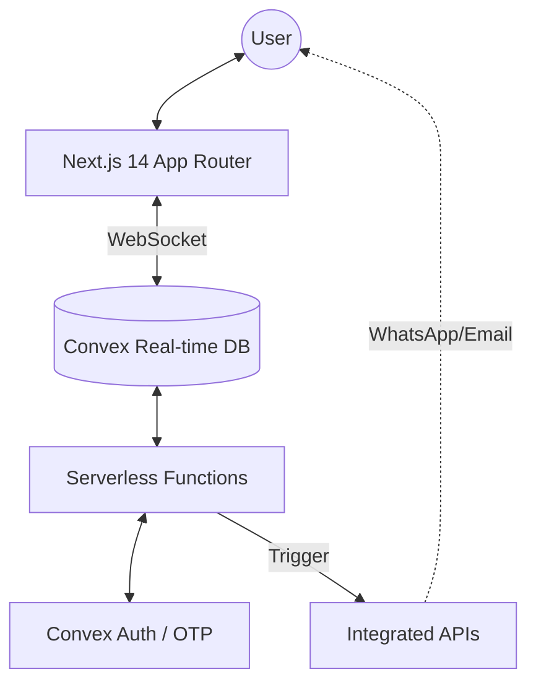
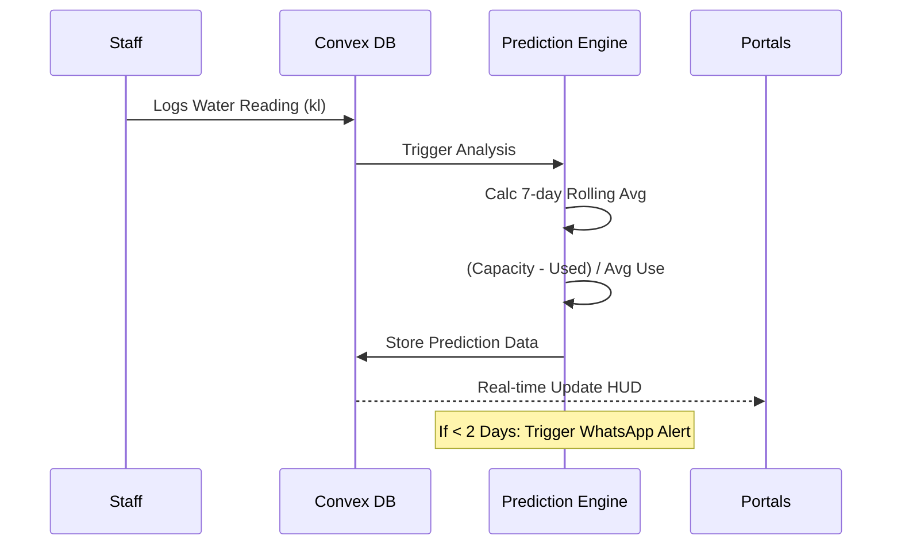
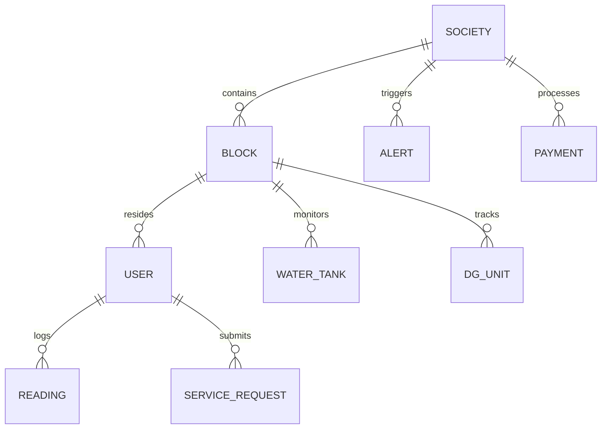

<div align="center">


# 🏢 BlockSenseAI
### The Smart Community Operating System

**A high-performance, real-time ecosystem designed for modern gated residential societies. Monitor utilities, manage residents, and predict resource needs with zero-latency synchronization.**

[](https://github.com/theyassirkhan/BlockSenseAI)
[](https://convex.dev/)
[](LICENSE)

[Overview](#-overview) • [Core Architecture](#-core-architecture) • [Portal Experiences](#-the-three-portal-experience) • [Technical Specs](#-technical-specifications) • [Getting Started](#-getting-started)

</div>

---

## 🌟 Overview

BlockSenseAI is not just a management app; it's an **Operating System** for communities. It addresses the fragmented nature of residential management by providing a single, real-time "Source of Truth" for resource consumption, security, and administrative operations.

### 🚀 Why BlockSenseAI?
- **Zero-Latency Sync**: Powered by Convex, every reading update reflects instantly across all portals.
- **Predictive Intelligence**: AI-lite models estimate when your water tanks will run dry or when the DG unit needs diesel.
- **Integrated Communications**: Direct-to-WhatsApp alerts and automated weekly digests.

---

## 🏗️ Core Architecture

The system is built on a "Real-time Serverless" paradigm, ensuring scalability without managing traditional infrastructure.

### 🌐 High-Level Flow


### 🛠️ Tech Stack & Connectivity
| Layer | Tech | Role |
| :--- | :--- | :--- |
| **Frontend** |  | App Router, Server Components, Hooks |
| **Backend** |  | Real-time DB, Serverless Functions, Crons |
| **Interface** |  | JIT Styling, Dynamic Dark Mode |
| **Components** |  | Radix UI Primitives, High-quality UI |
| **Analytics** |  | Consumption trends, Health Score visualization |
| **Auth** |  | OTP Email/WhatsApp, Anonymous, OAuth |

---

## 🎭 The Three-Portal Experience

BlockSenseAI adapts its interface based on user roles, ensuring complex operations remain simple for the end-user.

### 🛡️ Platform Admin Dashboard (`/admin`)
Designed for the BlockSense team to manage multiple societies.
- **Global Overview**: KPI matrix for all societies (MRR, Health, Active Users).
- **Society Management**: Provisioning, billing, and subscription plan (Basic/Pro/Enterprise) control.
- **Ticketing**: SLA-tracked support system for society RWA requests.

### 🏗️ RWA Committee Dashboard (`/dashboard`)
The "War Room" for society administrators and operational staff.
- **Utility Command Center**: Real-time gauges for Water, Power, Gas, and Sewage.
- **Workforce Management**: Staff shifts, attendance tracking, and vendor directory.
- **Financial Ledger**: Automated maintenance dues generation and payment confirmation workflow.

### 🏡 Resident Portal (`/resident`)
A lightweight, mobile-first experience for society members.
- **Personal Monitoring**: View block-wise tank levels and power status.
- **Self-Service**: Submit service requests, view notices, and pay maintenance dues.
- **Identity Control**: Update notification preferences (WhatsApp/In-app).

---

## 💧 Resource Intelligence

The platform doesn't just display data; it **predicts resource lifespan**.

### 📉 Prediction Logic Flow


---

## 📊 Database Specifications

The backend maintains a strict schema with 30+ tables to ensure data integrity across multi-tenant environments.

### 📈 Core Schema Overview


---

## 🚀 Getting Started

### 1. Prerequisites
- **Node.js** (v18+)
- **Convex Account** ([convex.dev](https://convex.dev))
- **Environment Keys**: MSG91 (WhatsApp), Resend (Email).

### 2. Installation
```bash
# Clone
git clone https://github.com/theyassirkhan/BlockSenseAI.git
cd BlockSenseAI

# Install dependencies
npm install

# Initialize Convex Backend
npx convex dev
```

### 3. Environment Variables
Create a `.env.local` file:
```bash
NEXT_PUBLIC_CONVEX_URL=https://your-deployment.convex.cloud

# Integrated Services
AUTH_RESEND_KEY=re_xxxxxxxxxxxx
MSG91_AUTH_KEY=your_msg91_key
RESEND_API_KEY=re_xxxxxxxxxxxx
```

---

## 🤝 Collaborations & Credits

Contributions are welcome to make community management smarter and safer for everyone.

**Core Developed by:**
### 🤵 [Yassir Khan](https://github.com/theyassirkhan)
*Full-stack Engineer & Architect*

---

<div align="center">

**Built with ❤️ for a Smarter Future**

[Report Bug](https://github.com/theyassirkhan/BlockSenseAI/issues) • [Request Feature](https://github.com/theyassirkhan/BlockSenseAI/issues)

</div>
