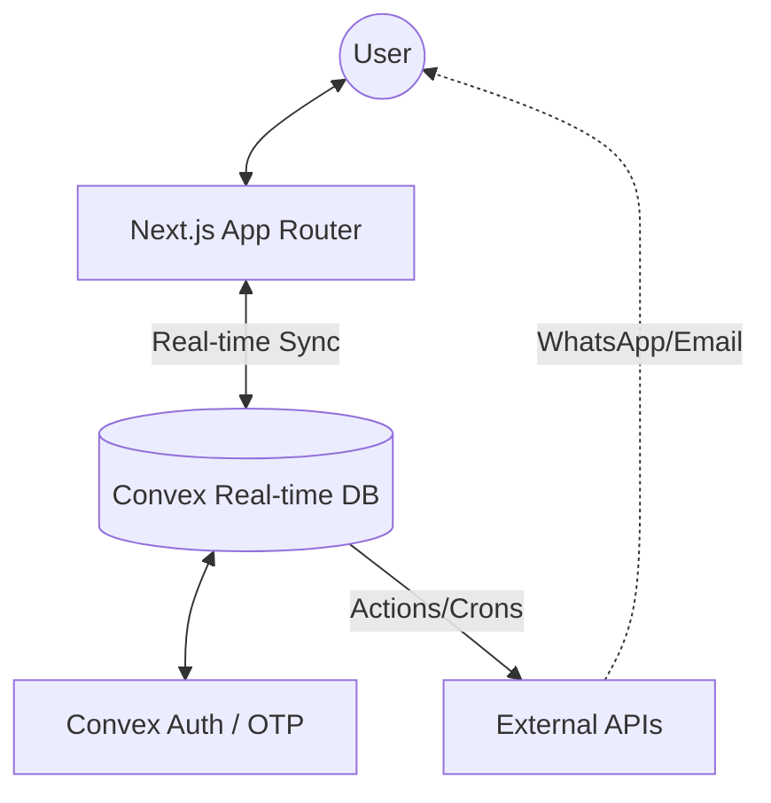
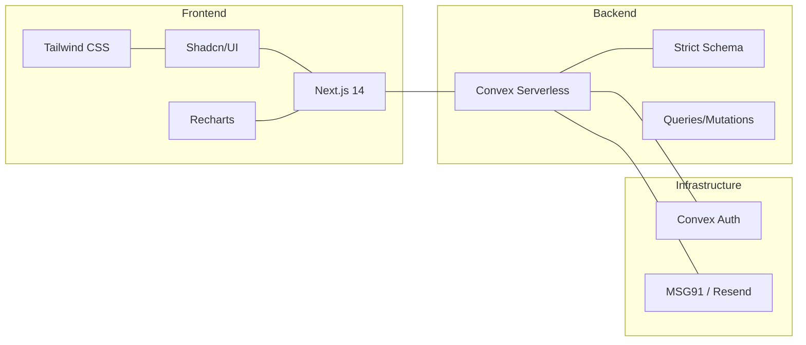

<div align="center">


# 🏢 BlockSenseAI
### The Smart Community Operating System

**Real-time utility monitoring, resident management, and automated intelligence for modern gated communities.**

[](https://nextjs.org/)
[](https://convex.dev/)
[](https://typescriptlang.org/)
[](https://tailwindcss.com/)
[](LICENSE)

[Exploration](#overview) • [Live Features](#live-features) • [Architecture](#architecture) • [Getting Started](#getting-started)

</div>

---

## 🌟 Overview

**BlockSenseAI** is a robust, full-stack community management platform designed to solve the complexities of gated residential societies. It bridges the gap between residents and management through a "Single Source of Truth" powered by **real-time WebSocket synchronization**.

### 🏢 One Platform, Three Experiences
- **🛡️ Platform Admin:** Cross-society oversight, billing, and global broadcasts.
- **🏗️ RWA Dashboard:** Full CRUD operations for society-level utility, staff, and resident management.
- **🏡 Resident Portal:** Real-time utility tracking, dues payment, and service request submission.

---

## 🏗️ System Architecture

BlockSenseAI leverages a modern serverless architecture where the frontend and backend are inextricably linked via real-time data streams.

### 🌐 High-Level Flow


### 🔗 Tech Stack Connectivity


---

## ✨ Live Features

| Category | Feature | Benefit |
| :--- | :--- | :--- |
| **💧 Water** | Tank level monitoring & Tanker Prediction | Never run out of water again. |
| **⚡ Power** | DG unit diesel tracking & Runtime prediction | Automated refuel alerts. |
| **🔥 Gas** | Pressure monitoring & supply status | Real-time safety and usage tracking. |
| **🗑️ Waste** | Segregation compliance & Leaderboards | gamified society sustainability. |
| **📢 Alerts** | Real-time multi-channel notifications | Instant WhatsApp/SMS/In-app alerts. |
| **💳 Payments** | Maintenance dues & Ledger tracking | Transparent accounts for every resident. |
| **🛠️ Service** | Automated ticketing & Rating system | Resolve resident issues faster. |

---

## 🛠️ Tech Stack

BlockSenseAI is built with the "Apex Stack" for speed, safety, and scalability:

- **Frontend:** Next.js 14 (App Router), React 18, TypeScript.
- **Styling:** Tailwind CSS, Radix UI, Shadcn/UI (Aesthetic Excellence).
- **Backend:** Convex (Real-time DB, Serverless Functions, Scheduling).
- **Auth:** Convex Auth (OTP Email/SMS, Anonymous, Google OAuth).
- **Automation:** 
    - **MSG91:** WhatsApp Business API for critical alerts.
    - **Resend:** Transactional email for OTPs and notifications.
- **Analytics:** Recharts for sleek consumption and health score trends.

---

## 🚀 Getting Started

### 1. Prerequisites
- Node.js 18+
- Convex Account

### 2. Quick Setup
```bash
# Clone the repository
git clone https://github.com/theyassirkhan/BlockSenseAI.git
cd BlockSenseAI

# Install dependencies
npm install

# Connect to Convex (Frontend + Backend)
npx convex dev
```

### 3. Environment Configuration
Ensure your `.env.local` contains:
```env
NEXT_PUBLIC_CONVEX_URL=https://your-deployment.convex.cloud
AUTH_RESEND_KEY=re_xxxxxxxxxxxx
MSG91_AUTH_KEY=your_msg91_key
```

---

## 📁 project Structure

```text
BlockSenseAI/
├── app/                  # Next.js App Router (Admin/RWA/Resident)
├── component/            # Shared shadcn/ui library
├── convex/               # Backend Logic (26 Tables, Crons, Predictions)
├── hooks/                # Custom React hooks for global state
├── lib/                  # Utility functions & formatting
└── public/               # Asset management
```

---

## 📈 Prediction Engine

BlockSenseAI doesn't just monitor; it **foresees**.
Using rolling average consumption models, the platform predicts:
- **Water Runout Date:** Based on current tank levels and 7-day average usage.
- **Diesel Depletion:** Estimated hours left during power outages.

---

## 🤝 Contributing

Contributions are what make the open source community such an amazing place to learn, inspire, and create.

1. Fork the Project
2. Create your Feature Branch (`git checkout -b feature/AmazingFeature`)
3. Commit your Changes (`git commit -m 'Add some AmazingFeature'`)
4. Push to the Branch (`git push origin feature/AmazingFeature`)
5. Open a Pull Request

---

## 📜 License

Distributed under the MIT License. See `LICENSE` for more information.

---

<div align="center">

**Built with ❤️ by [Yassir Khan](https://github.com/theyassirkhan)**

[Report Bug](https://github.com/theyassirkhan/BlockSenseAI/issues) • [Request Feature](https://github.com/theyassirkhan/BlockSenseAI/issues)

</div>
